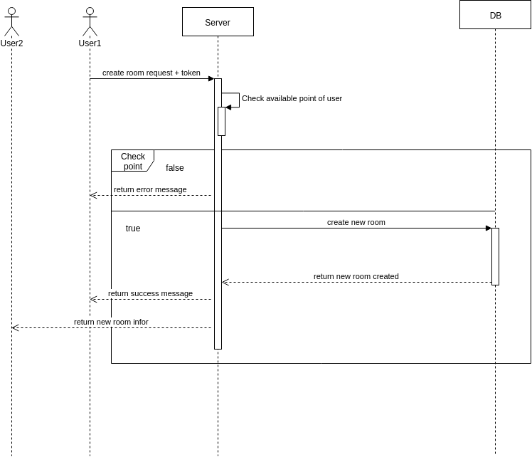

# Best Caro

## 1. Architecture


## 2. Usecase


## 3. Database design


## 4. Rest API

### User

### Login (/login) [POST]

+ Request:

    ```
        {
            username: 'haopn',
            password: 'key1234'
        }
    ```

+ Response:

    + Ok (200):

        ```
            {
                data:
                {
                    token:
                    user:
                    {
                        username:
                        win_game:
                        total_game:
                        point:
                    }
                }
            }
        ```

    + Unauthorized (401):

        ```
            {
                data:
                {
                    error_message: 'Login failed'
                }
            }
        ```

### Register (/register) [POST]

+ Request:

    ```
        {
            username:
            password:
        }
    ```

+ Response:

    + Ok (200):

        ```
            {
                data:
                {
                    token:
                    user:
                    {
                        username:
                        win_game:
                        total_game:
                        point:
                    }
                }
            }
        ```

    + Bad request (400):

        ```
            {
                data:
                {
                    error_message: 'Username is already exist'
                }
            }
        ```


### Room

#### All room (/allroom) [GET]

+ Request:

    ```
        {
            token:
            user_id:
        }
    ```

+ Response:

    + Ok (200)

        ```
            {
                data:
                {
                    [
                        id:
                        matchName:
                        bet_point:
                    ],
                    [
                        id:
                        matchName:
                        bet_point:
                    ],
                }
            }
        ```

    + Not found (404)

        ```
             {
                data:
                    {
                        error_message: "Not found"
                    }
            }
        ```

## 5. Websocket

### Authenticated

+ Request

    ```
        {
            header: 'authenticated',
            token: 
        }
    ```

+ Response:

    ```
        {
            header: 'authenticated',
            data: 'success connected websocket server'
        }
    ```

### Room

#### Create room

+ Request:

    ```
        {
            header: 'create_room'
            data:
            {
                token:
                host:
                host_id:
                bet_point:
            }
        }
    ```

+ Response:

    ```
        {
            header: 'create_room',
            data: room
        }
    ```

#### Join room

+ Request:

    ```
        {
            header: 'join_room'
            data:
            {
                token:
                room_id:
                guest:
                guest_id:
            }
        }
    ```

+ Response:

    ```
        {
            header: 'join_room',
            data: room
        }
    ```

### Game

#### Play game

+ Request:

    ```
        {
            header: 'play_game',
            data:
            {
                token:
                user_id:
                room_id:
                x:
                y:
            }
        }
    ```

+ Response:

    ```
        {
            header: 'play_game',
            data:
            {
                x:
                y:
                value:
                # 1 if host and 2 if guest
            }
        }
    ```

#### Game result

+ Request

    ```
        {
            header: 'game_result',
            data:
            {
                token:
                room_id:
                sender:
                result:
            }
        }
    ```

+ Response:

    ```
        {
            header: 'game_result',
            data:
            {
                result: result
            }
        }
    ```

#### Top rank

+ Response:

    ```
        {
            header: 'rank',
            data: listTop
            # top 5 user 
        }
    ```

### Chat

+ Request: 

    ```
        {
            header: 'chat',
            data:
            {
                token:
                room_id:
                sender:
                content:
            }
        }
    ```

+ Response:

    ```
        {
            header: 'chat',
            data:
            {
                content: content,
                sender: sender
            }
        }
    ```

## 6. Flow Game Play


## 7. Sequence diagram

+ New room

    <div align="center">
        
    </div>

+ Join room

    <div align="center">
        
    </div>

+ Play game

    <div align="center">
        
    </div>