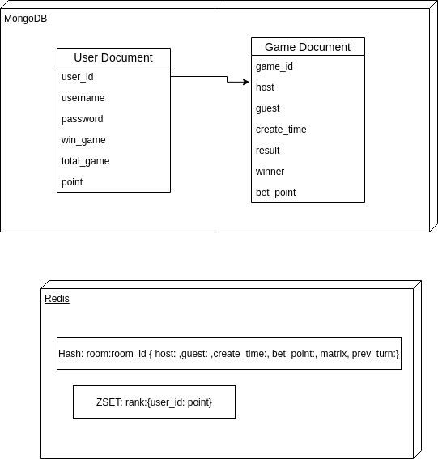

# Đồ án Kakuro (Game Caro)

## Mô tả chức năng

+ Đăng ký, đăng nhập vào game
+ Tạo phòng chơi game (có cược điểm)
+ Tham gia vào một phòng có sẵn
+ Chat trong khi chơi
+ Hiển thị top 5 users có điểm số cao nhất

## Luật chơi game caro

+ User đánh đủ 5 ô liên tiếp sẽ là người thắng cuộc (5 ô theo chiều dọc, ngang, đường chéo chính và đường chéo phụ)

## Công nghệ sử dụng

+ Front end:
  + ReactJS
  + Redux
  + Ant design
  + React Boootstrap 
+ Back end:
  + NodeJS
  + MongoDB (lưu persistent)
  + Redis (lưu cache)
  + HTTP Restful API
  + Websocket 

## Các mô hình

+ Architecture

    <div align="center">
        
    </div>

+ Database

    <div align="center">
        
    </div>

## Hướng dẫn cài đặt

+ Yêu cầu:
  + node và npm
  + redis server
  + mongoDB (có thể sử dụng local hoặc mongoDB cluster)

+ Tạo database cho mongoDB 

+ Start redis-server

    ```
        redis-server
    ```

+ Front end:

    ```
        sudo npm install
    ```

    ```
        sudo npm start
    ```

+ Back end:

    ```
        sudo npm install
    ```

    ```
        node index.js
    ```

## Người thực hiện

+ Phạm Nhật Hào
+ Đặng Thị Huyền Trâm
